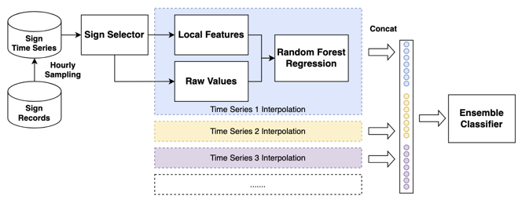

# MedLens: Improve Mortality Prediction Via Medical Signs Selecting and Regression

This repository contains the code for the paper titled [MedLens: Improve Mortality Prediction Via Medical Signs Selecting and Regression](https://ieeexplore.ieee.org/abstract/document/10201302)

## Overview

MedLens aims to improve patient health monitoring and mortality prediction by addressing the data-quality problem associated with clinical signs. After assessing the missing rate and correlation score across various medical signs and a large number of patient hospital admission records, MedLens applies an automatic vital medical signs selection approach via statistics and a flexible interpolation approach for high missing rate time series. The resulting ensemble classifiers boost the accuracy and reduce the computation overhead, achieving a high performance of 0.96 AUC-ROC and 0.81 AUC-PR.

## Citation

If you use this code in your research, please cite the following publication.

```
@inproceedings{ye2023medlens,
  title={MedLens: Improve Mortality Prediction Via Medical Signs Selecting and Regression},
  author={Ye, Xuesong and Wu, Jun and Mou, Chengjie and Dai, Weinan},
  booktitle={2023 IEEE 3rd International Conference on Computer Communication and Artificial Intelligence (CCAI)},
  pages={169--175},
  year={2023},
  organization={IEEE}
}
```

Please be sure also to cite the original [MedLens Paper](https://ieeexplore.ieee.org/abstract/document/10201302)

### Corrections

As mentioned by Jessica Hullman in [IEEE’s Refusal to Issue Corrections](https://statmodeling.stat.columbia.edu/2020/12/10/ieees-refusal-to-issue-corrections/), I also attempted to get permission from IEEE to correct a typo in my paper, but unfortunately, it was not allowed.

The last sentence of the abstract,

It achieves a very high accuracy performance of *0.96%* AUC-ROC and *0.81%* AUC-PR, which exceeds the previous benchmark.

should be corrected to

It achieves a very high accuracy performance of **0.96** AUC-ROC and **0.81** AUC-PR, which exceeds the previous benchmark.

I have uploaded the corrected version on [arXiv](https://arxiv.org/abs/2305.11742). The only difference between the two versions is that the arXiv version has the extraneous % removed.

## Architecture



## Results

Accuracy Performance and Time Consuming Across Various Classifiers


Performance Under Different Interpolation Methods


### Compare with previous works


## Prerequsites

The code requires the following Python packages:

- Python 3.x
- numpy
- pandas
- sklearn

## Installation & Usage

1. Clone this repository to your local machine.
2. Prepare the corresponding MIMIC III dataset.
3. Install the necessary Python packages listed in the Prerequisites section.
4. Run the following scripts in the order provided:
   - `top_itemid_selection.py` to select relevant items.
   - `extract_logs.py` to parse the dataset CSV files.
   - `generate_time_series_logs.py` to generate time series files.
   - `itemid_hospital_expire_correlation.py`, `missing_data_rates.py` for statistics.
   - `mortality_prediction.py` for interpolation and prediction.
